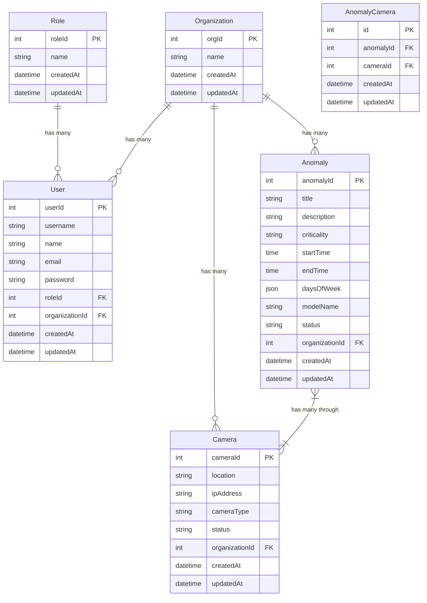

```mermaid
erDiagram
    Role {
        int roleId PK
        string name
        datetime createdAt
        datetime updatedAt
    }

    User {
        int userId PK
        string username
        string name
        string email
        string password
        int roleId FK
        int organizationId FK
        datetime createdAt
        datetime updatedAt
    }

    Organization {
        int orgId PK
        string name
        datetime createdAt
        datetime updatedAt
    }

    Camera {
        int cameraId PK
        string location
        string ipAddress
        string cameraType
        string status
        int organizationId FK
        datetime createdAt
        datetime updatedAt
    }

    Anomaly {
        int anomalyId PK
        string title
        string description
        string criticality
        time startTime
        time endTime
        json daysOfWeek
        string modelName
        string status
        int organizationId FK
        datetime createdAt
        datetime updatedAt
    }

    AnomalyCamera {
        int id PK
        int anomalyId FK
        int cameraId FK
        datetime createdAt
        datetime updatedAt
    }

    Role ||--o{ User : "has many"
    Organization ||--o{ User : "has many"
    Organization ||--o{ Camera : "has many"
    Organization ||--o{ Anomaly : "has many"
    Anomaly }|--|{ Camera : "has many through"
```