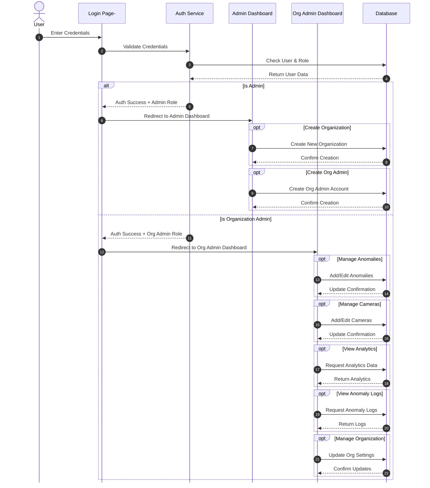

```mermaid
%%{init: { 'sequence': {'mirrorActors':false} } }%%
sequenceDiagram
	autonumber
    actor U as User
    participant LP as Login Page-
    participant AS as Auth Service
    participant AD as Admin Dashboard
    participant OD as Org Admin Dashboard
    participant DB as Database

    %% Login Flow
    U->>LP: Enter Credentials
    LP->>AS: Validate Credentials
    AS->>DB: Check User & Role
    DB-->>AS: Return User Data
    
    alt is Admin
        AS-->>LP: Auth Success + Admin Role
        LP->>AD: Redirect to Admin Dashboard
        
        %% Admin Operations
        opt Create Organization
            AD->>DB: Create New Organization
            DB-->>AD: Confirm Creation
        end
        
        opt Create Org Admin
            AD->>DB: Create Org Admin Account
            DB-->>AD: Confirm Creation
        end
        
    else is Organization Admin
        AS-->>LP: Auth Success + Org Admin Role
        LP->>OD: Redirect to Org Admin Dashboard
        
        %% Org Admin Operations
        opt Manage Anomalies
            OD->>DB: Add/Edit Anomalies
            DB-->>OD: Update Confirmation
        end
        
        opt Manage Cameras
            OD->>DB: Add/Edit Cameras
            DB-->>OD: Update Confirmation
        end
        
        opt View Analytics
            OD->>DB: Request Analytics Data
            DB-->>OD: Return Analytics
        end
        
        opt View Anomaly Logs
            OD->>DB: Request Anomaly Logs
            DB-->>OD: Return Logs
        end
        
        opt Manage Organization
            OD->>DB: Update Org Settings
            DB-->>OD: Confirm Updates
        end
    end
```
