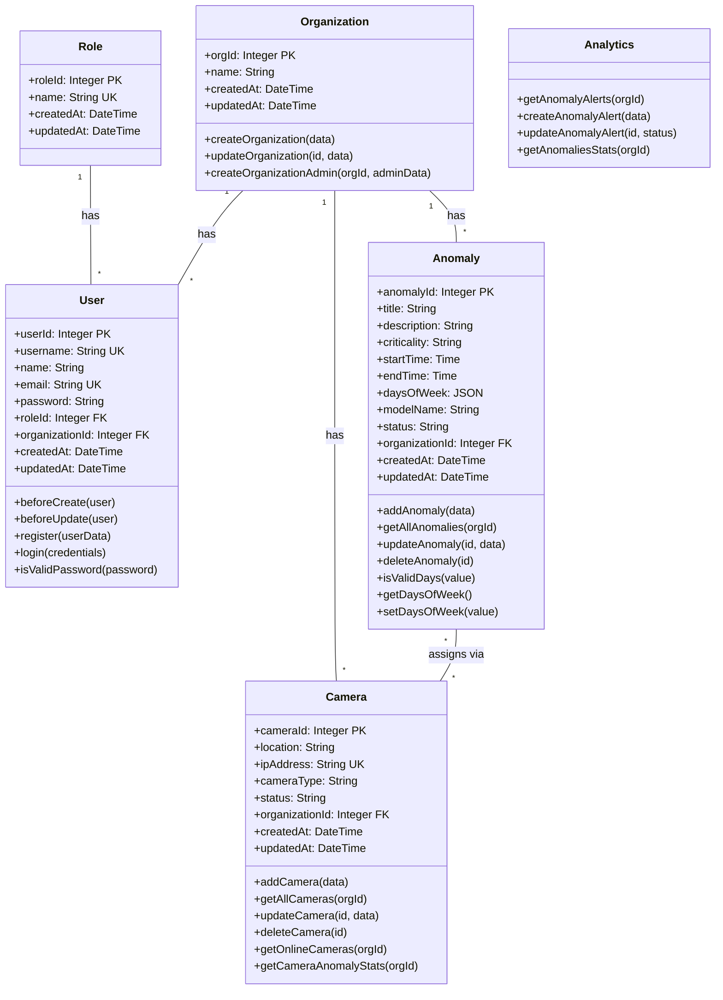

```mermaid
classDiagram
    class Role {
        +roleId: Integer PK
        +name: String UK
        +createdAt: DateTime
        +updatedAt: DateTime
    }

    class User {
        +userId: Integer PK
        +username: String UK
        +name: String
        +email: String UK
        +password: String
        +roleId: Integer FK
        +organizationId: Integer FK
        +createdAt: DateTime
        +updatedAt: DateTime
        +beforeCreate(user)
        +beforeUpdate(user)
        +register(userData)
        +login(credentials)
        +isValidPassword(password)
    }

    class Organization {
        +orgId: Integer PK
        +name: String
        +createdAt: DateTime
        +updatedAt: DateTime
        +createOrganization(data)
        +updateOrganization(id, data)
        +createOrganizationAdmin(orgId, adminData)
    }

    class Camera {
        +cameraId: Integer PK
        +location: String
        +ipAddress: String UK
        +cameraType: String
        +status: String
        +organizationId: Integer FK
        +createdAt: DateTime
        +updatedAt: DateTime
        +addCamera(data)
        +getAllCameras(orgId)
        +updateCamera(id, data)
        +deleteCamera(id)
        +getOnlineCameras(orgId)
        +getCameraAnomalyStats(orgId)
    }

    class Anomaly {
        +anomalyId: Integer PK
        +title: String
        +description: String
        +criticality: String
        +startTime: Time
        +endTime: Time
        +daysOfWeek: JSON
        +modelName: String
        +status: String
        +organizationId: Integer FK
        +createdAt: DateTime
        +updatedAt: DateTime
        +addAnomaly(data)
        +getAllAnomalies(orgId)
        +updateAnomaly(id, data)
        +deleteAnomaly(id)
        +isValidDays(value)
        +getDaysOfWeek()
        +setDaysOfWeek(value)
    }

    class Analytics {
        +getAnomalyAlerts(orgId)
        +createAnomalyAlert(data)
        +updateAnomalyAlert(id, status)
        +getAnomaliesStats(orgId)
    }

    Role "1" -- "*" User : has
    Organization "1" -- "*" User : has
    Organization "1" -- "*" Camera : has
    Organization "1" -- "*" Anomaly : has
    Anomaly "*" -- "*" Camera : assigns via
```
